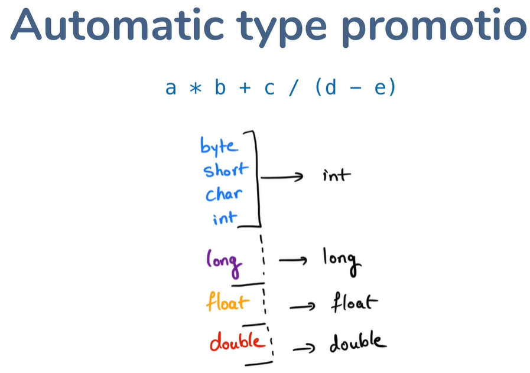

## Literals

##### Int Literals
```java
 int a = 10;
 
 int b = 0b1010;
 
 int c = 25_000;
```

##### Double Literals
```java
 double price = 25.25;

 double price = 25D;

 double co_eff = 23_503.75_01;

 double val = 5.012E15;
```
_______


## Strongly Typed

- Java is Static typed lang.
- Every variable has a type.

##### What is static typing?
- The type of variable is chosen at compile time 
we write the code not during run time.

```java
<type> varName = <value>
```
- LHS type should be equal / compatible to RHS type.

_______


## Type Conversion

```java
double a = 10; // this works
int b = a; // doesn't work  
```

##### Acceptable type conversion

- short to int
- byte to int
- int to double
- float to double

#### Type Casting

- When we force conversion not automatic by java

```java
double a = 10; // this works
int b = a; // doesn't work  
int b = (int) a; // Now it works
```

_______

### Automatic Type Promotion

##### What happens when one expression has multiple types?
 - Java automatically promotes the lower type to higher type.
 - Below the int is promoted to double and the res of double is stored in variable c.

```java
double a = 10;
int b = 5;

var c = a * b;
```

##### Type of expression result


- If there is a long and int all the variables get converted to long.
- If there is a double, all the variables get converted to double.

___________


## Arrays

#### Declaration
- Declares slNos as an int array.
```java
int[] slNos;
```

#### Assignment
- Declares slNos as an int arrays and assigns 10 int array space.
```java
int[] slNos = new int[10];
```


#### Access by Index

```java
int[] slNos = new int[10];

slNos[0] = 25;
slNos[3] = 1000;
```

#### Array initializer

```java
int[] slNos = {21,25,28,36};
```

______

## Multidimensional Arrays

#### Declaration 

```java
int[][] matrix = new int[3][5];
```

#### Initializing
```java
int[][] matrix = {{1,1}, {2,2}, {3,3}}
```


